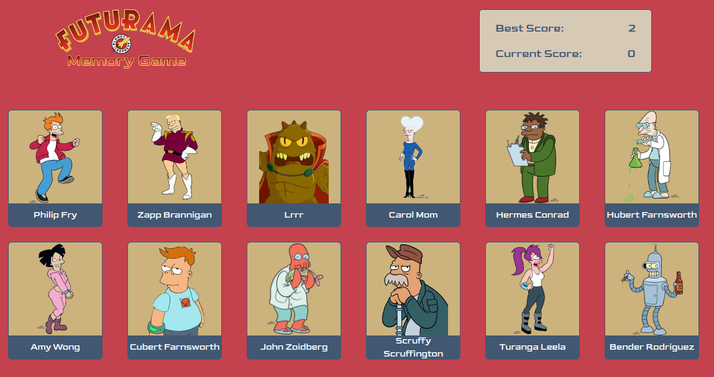

# Memory Card App

[Memory Card App Live Link](https://memory-card-app-94p.pages.dev/)

## Objective

Create a memory card application using React. The main focus of the application is to utilize the following concepts:

- Create and setup a new React Project utilizing Vite
- Manage and utilize states
- Fetch and use data from an external API.

\*API data was obtained from [Sample APIs](https://sampleapis.com)

## How to Play

- Start the game by clicking on a card
- Earn points by clicking cards that have NOT yet been selected
- The game ends when the user selects a card already selected

\*Highest score is kept until the user closes or reloads the browser

